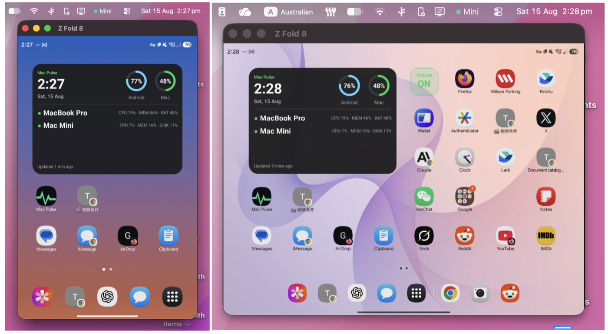
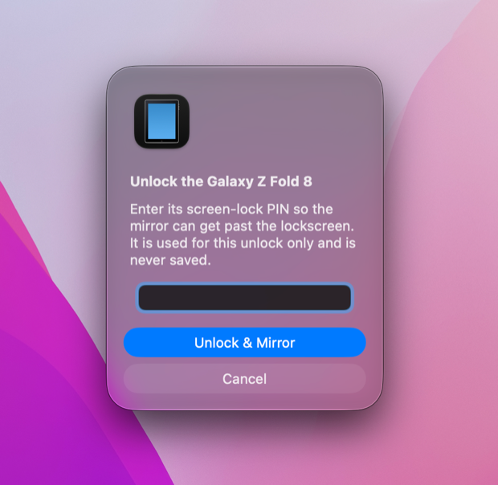
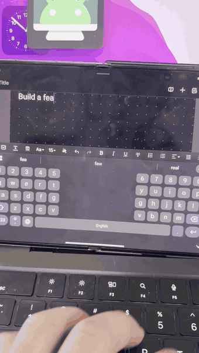
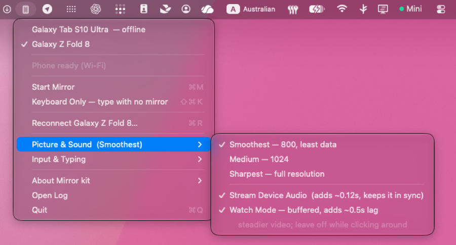

# Mirror kit

Put an Android phone or tablet on your Mac — the screen in a window you can
click, the keyboard and trackpad acting as real hardware on the device, and the
sound coming out of your Mac speakers. Like iPhone Mirroring, except it works
with Android, and over the internet if you want it to.



The same window a minute apart. Nothing was restarted in between — the phone was
opened, and the mirror followed it from the cover screen to the inner one. (A
foldable thing; on an ordinary phone there is only ever one screen to show.)

## Two things it does that you would not expect

### It asks for the PIN on the Mac, and never keeps it

A locked phone gives the mirror a black rectangle rather than a lockscreen.
Android marks the PIN prompt as a secure window and will not allow it to be
captured, so there is genuinely nothing on screen to aim at — you would be
typing blind at a black box.

So the PIN is asked for here instead, and typed onto the device for you.



**It is never saved — not to a file, not to the keychain, not anywhere.** It
exists for the length of that one unlock and is asked for again the next time.
That is a deliberate trade: remembering it would be more convenient, and it
would also mean your phone's PIN sitting on a disk.

### It can be your phone's keyboard with no mirror at all

The Mac keyboard registers on the device as real USB hardware. The phone's own
keyboard and IME handle it — so Chinese works, which the ordinary mirroring mode
cannot do, because that one drops anything outside ASCII.

Nothing appears on your Mac screen. You look at the phone and type on the Mac.



That is the phone's own suggestion strip reacting to each keystroke, not a
picture of one — the hands in shot are on the Mac.

## Everything else it does

**Use the phone without touching it.** Its screen is a window on the Mac, and
your trackpad and keyboard drive it.

**Hear it through the Mac.** The phone's audio arrives on your speakers and the
phone itself goes quiet, so it is not playing to an empty room.

**Reach it from somewhere else.** Over [Tailscale](https://tailscale.com) the
phone does not have to be on your Wi-Fi — or in your house.

**Mirror more than one device at the same time.** Each has its own window, its
own settings and its own start and stop — a phone and a tablet side by side, or
two phones. They are listed at the top of the menu with what each is currently
doing, and switching between them starts and stops nothing. (Apple's iPhone
Mirroring does one device at a time.)

**Pick what the picture costs.** Three quality tiers — 800, 1024, or the panel's
full resolution — because a phone across a jittery Wi-Fi link and one on a cable
do not want the same settings. Sound is a separate switch, and Watch Mode
buffers both streams half a second for video, where smoothness matters and
latency does not.



Both devices are listed whichever one you are driving, and the current quality
is on the parent row so you can see it without opening anything.

**Drag a file onto the window** to push it to the phone; drop an APK and it
installs. That is scrcpy's own feature, not mine — all I changed is where things
land. scrcpy drops them in the device's Downloads folder, where they are
immediately indistinguishable from everything the phone downloaded itself, so
here they go to `Download/FromMac/`. Set `pushTarget` per device if you want
them somewhere else.

### What it is not for

**Games where reflexes decide it.** Shooters, racing, rhythm games, anything
where a late frame loses you the round — the wrong use of this. Every frame is
captured on the phone, encoded, sent over a network, decoded and drawn, which is
tens of milliseconds on a good link. This is tuned to survive a bad link, not to
shave the last millisecond off a good one.

Turn-based games are fine. Strategy, tactics, card games, anything you would
happily play while thinking about it — a tenth of a second between clicking and
seeing does not matter when the game is waiting for you anyway. Just leave Watch
Mode off, since half a second of buffer is worth it for video and not for
something you are touching.

---

Two pieces, both optional on their own:

- **`mirror`** — the command line. `mirror phone`, `mirror phone sound`, etc.
- **Android Mirror.app** — a menu bar icon doing the same things with a mouse.

Both read the same device list, so adding a device once adds it everywhere.

The work is done by [scrcpy](https://github.com/Genymobile/scrcpy), which is where
the credit belongs. This wraps it: it remembers your devices, picks settings that
survive a jittery Wi-Fi link, gets past the lockscreen, and puts the whole thing
behind one command or one menu.

## What it is tested on

**A Galaxy Z Fold 8, a Galaxy S23 Ultra, and a Galaxy Tab S10 Ultra**, all Samsung,
all over [Tailscale](https://tailscale.com). That is the honest scope — the Fold is
what it was written for, and it is the device every rough edge was found on.

It should work on any device that speaks adb, because scrcpy does. But the parts
that had to be taught about a specific device live in `devices.json`, and defaults
that suit one phone are guesses elsewhere:

- **Screen-off** blanks capture on the Fold 8 (Android 17), so it is disabled for it
  via `screenOffBreaksCapture`. On your device it may work fine — try it.
- **Unlocking** is written against Samsung's lockscreen (`unlockStyle`). Other skins
  put the PIN prompt together differently; set `"unlockStyle": "none"` and unlock the
  device by hand if it misbehaves.
- **Samsung's accidental-switch-on guard** is detected by a window name only One UI
  has. Elsewhere the check simply never matches, which is harmless.
- **Folding** is handled by capturing display 0 and letting Android switch panels
  underneath. That is a foldable concern; on a normal phone it is one screen and
  nothing to think about.

If it does something stupid on a non-Samsung device, that is a bug worth reporting —
but be aware I cannot reproduce it, so please include what `mirror <id>` printed.

---

## Install

```bash
brew tap lj-builds/tap
brew trust lj-builds/tap
brew install mirror-kit
open "$(brew --prefix)/opt/mirror-kit/Android Mirror.app"
```

That last line opens a setup window that does the rest. It finds your device,
reads its address off the cable itself, and offers to start at login. There is
nothing to type into a config file and nothing to look up.

`brew trust` is in there because Homebrew will not load a formula from a
third-party tap until you say you trust it. Read
[the formula](https://github.com/LJ-builds/homebrew-tap/blob/main/Formula/mirror-kit.rb)
first if you like — it is 100 lines and it builds this repo, nothing else. It is
a decision worth making yourself: the point of that command is that somebody
looked.

**If you have asked an assistant to install this for you**, it can run all four
commands and open the window, and then it is done — adding the device needs a
cable physically plugged in and a prompt tapped on the phone's own screen, and
nothing running on the Mac can do either. Expect to be handed a window that is
waiting for you, and treat that as the install having worked.

### Before you start

- **A Mac with Apple Silicon.** The `mirror` command works on Intel too; the
  menu bar app is not built there.
- **[Homebrew](https://brew.sh).** If `brew --version` says "command not found",
  install it first and follow the two lines it prints at the end about adding it
  to your PATH — skipping those is why `brew` still seems missing afterwards.
- **An Android device**, 8.0 or newer, and a USB cable for the first minute.

scrcpy comes with it. adb is one click inside the setup window — Homebrew ships
adb only as a cask, and a formula is not allowed to depend on one, so the app
installs it instead of leaving you a note about it.

### What the setup window does

Six short steps, and every one of them either finds its own answer or gives you
the button that gets past it. Nothing sends you away to come back later.

1. **Tools** — shows scrcpy and adb with a tick or an Install button each. Skipped
   entirely if both are already there, which after `brew install` is the usual case.
2. **Device** — plug it in. The window watches the cable and tells the states
   apart: nothing connected, connected but *waiting for you to tap "Allow USB
   debugging?"* on the device, or found — in which case it names the model.
3. **Name** — a short id for `mirror <id>`, prefilled from the model.
4. **Reach** — same Wi-Fi, or [Tailscale](https://tailscale.com) so it works from
   anywhere. **Both addresses are read off the device**, so there is nothing to
   go and find in Settings.
5. It switches the device to wireless debugging and writes the config.
6. **Done** — start at login, and optionally the `mirror` terminal command.

Then unplug the cable. It is not needed again.

**First time on this device?** Enable developer access once, before step 2:
**Settings → About phone →** tap **Build number** seven times, then
**Settings → Developer options → USB debugging → on.**

### That's it

```bash
mirror list          # what's configured
mirror <id>          # mirror it
```

Or use the phone icon in your menu bar. To add a second device later, use
**Add Another Device…** in that menu, or run `mirror add`.

### Updating

```bash
brew upgrade mirror-kit
```

Your device list is untouched — it lives in `~/.config/mirror/`, not in the
install.

### Installing without Homebrew

Cloning and building works too, and is what to use if you are changing the code:

```bash
git clone https://github.com/LJ-builds/mirror-kit.git
cd mirror-kit
bash setup.sh
```

`setup.sh` asks the same questions in a terminal; `install.sh` is the same work
with no questions, safe to re-run, and leaves your device list alone.

### If something goes wrong

- **"Your Xcode is too outdated"** during `brew install` — the Homebrew route
  compiles on your machine, and Homebrew will not start unless your developer
  tools match your macOS version. `xcode-select --install` fixes it. So does the
  clone route above, which calls `swiftc` directly and does not check.
- **`command not found: brew`** — Homebrew is not installed, or not on your PATH.
  See "Before you start".
- **`command not found: mirror`** — `~/bin` is not on your PATH. Add
  `export PATH="$HOME/bin:$PATH"` to `~/.zshrc`, open a new terminal, or just use
  the menu bar app.
- **No menu bar icon** — the Swift compiler was missing when you installed. Run
  `xcode-select --install`, then `bash install.sh` again.
- **Anything else** — `~/Library/Logs/mirror-menubar.log` has the details, and
  [an issue](https://github.com/LJ-builds/mirror-kit/issues) with that in it is
  genuinely useful.

If the device refuses to talk over USB, you need Developer options on it:
**Settings → About phone → tap "Build number" seven times**, then
**Settings → Developer options → USB debugging → ON**, and accept the prompt
that appears when you plug it in.

### About the menu bar app and Gatekeeper

`install.sh` compiles the app on your own machine rather than shipping you a
binary. That is deliberate: a locally built app carries no quarantine flag, so
macOS never blocks it and no Apple Developer account is involved anywhere. The
cost is that you need `swiftc`, which comes with the Xcode Command Line Tools
(`xcode-select --install`). Skip it and the `mirror` command still works alone.

---

## Using it

```
mirror <id>              mirror the screen; unlocks the device first if needed
mirror <id> sound        ...and bring its audio to the Mac
mirror <id> music        audio only — no window, device stays locked in a pocket
mirror <id> watch        mirror + sound, heavily buffered for watching video
mirror <id> keys         no mirroring; Mac keyboard/trackpad act as USB hardware
mirror <id> big          mirror a separate virtual screen, not the real one
mirror <id> hush         stop only the audio, keep the mirror running

mirror <id> frugal       800px / 4M — least data, for a metered or weak link
mirror <id> medium       1024px / 6M — the default
mirror <id> sharp        full resolution / 24M — detail over frames
```

They compose: `mirror phone watch sharp` is a buffered, full-resolution mirror
with sound. Anything else on the line is passed straight to `scrcpy`, so
`mirror phone -f` is fullscreen.

**The three quality words are the menu bar app's three levels**, with the same
numbers, so a device does not look different depending on which one started it.
A device plugged in over USB ignores them and gets the full-quality profile —
there is bandwidth to spare and nothing to trade off. Over Wi-Fi the enemy is
latency rather than bandwidth, which is why even `sharp` stays on H.264.

**`keys` is the interesting one.** It registers a genuine USB keyboard on the
device, so Android hands your keystrokes to the device's own input method —
which means Chinese, Japanese and Korean input work exactly as they do with a
Bluetooth keyboard. A small placeholder window appears and has to stay focused
for the Mac to forward what you type.

**`hush` exists because scrcpy has no runtime audio switch.** Audio always runs
as its own process, so stopping it hands the sound back to the device instantly
without dropping the mirror or the connection.

### From the menu bar

The same things, with a mouse. Everything above has a menu item except `music`
and `keys`' composability:

| Menu | Same as |
| --- | --- |
| Start Mirror | `mirror <id>` |
| Start with Device Screen Off | — (hidden where `screenOffBreaksCapture` is set) |
| Start on a Separate Screen | `mirror <id> big` (only for a device with `virtualDisplay`) |
| Keyboard Only | `mirror <id> keys` |
| Hand Sound Back | `mirror <id> hush` |
| Picture & Sound → the three levels | `frugal` / `medium` / `sharp` |
| Picture & Sound → Watch Mode | `mirror <id> watch` |

Sound is its own scrcpy process in both, so turning it **off** is instant and
never disturbs the picture. Turning it **on** relaunches the picture, because
audio and video have to be buffered by the same number of milliseconds or the
sound simply arrives late — and that buffer is fixed when scrcpy starts.

---

## Configuration

Everything lives in `~/.config/mirror/devices.json`. `mirror add` writes it;
after that it is a normal file you can edit. See `devices.example.json` for
every field with an explanation.

The fields worth knowing about:

| Field | What it does |
| --- | --- |
| `host` | LAN address, or a Tailscale one to reach the device from anywhere. Omit for a USB-only device |
| `kind` | `phone` or `tablet` — picks the icon and offers the tablet's force-landscape option |
| `unlockStyle` | `samsung` turns on One UI keyguard handling, `generic` does the basics, `none` never touches the lock screen |
| `virtualDisplay` | Size/dpi for `big`, e.g. `2448x1848/420`. Omit and the mode is refused rather than guessed |
| `screenOffBreaksCapture` | Set true if `--turn-screen-off` gives you a black mirror on this device |
| `maxSize` | Pins the mirror's width, overriding whichever quality level is picked. Omit it — the levels are tuned per link and are the better default |

### Mirroring from outside the house

Put [Tailscale](https://tailscale.com) on both the Mac and the device, then use
the device's Tailscale address (`100.x.y.z`) as its `host`. Nothing else
changes. On a LAN, a plain `192.168.x.x` address works and Tailscale is not
needed at all.

---

## Known limits

- **Apple Silicon only** for the menu bar app. The `mirror` command is fine
  anywhere.
- **The unlock automation was written against Samsung One UI.** On other makes
  it degrades to a wake-and-swipe (`unlockStyle: generic`) rather than typing a
  PIN. Set `unlockStyle: none` if you would rather it never tried.
- **An Android reboot turns wireless debugging off** and drops the pinned port.
  `mirror <id>` notices, explains it, and asks for the new port once; it then
  re-pins so the next launch needs nothing.
- **`--turn-screen-off` is broken on some devices** (verified on a Galaxy Z Fold
  8 running Android 17): the panel-off call kills the capture pipeline and the
  mirror goes permanently black. Use `big` instead — a virtual display works
  while the device is locked and shut.

---

## Optional: a "sound back to my phone" button

This one is for me, and it is left in because it costs nothing to ignore. I run a
small private HTTP service on the Mac and an [ntfy](https://ntfy.sh) topic on the
phone; filling in the `notify` block in `devices.json` makes starting audio push a
notification carrying a button that stops the stream. Those two services are not
part of this repo, so unless you happen to run something answering the same shape
of request, leave the block out. Nothing breaks without it — it is skipped
entirely, and `mirror <id> hush` still works from the Mac.

## Uninstall

If you installed with Homebrew:

```bash
launchctl bootout gui/$(id -u)/com.mirrorkit.menubar
rm -f ~/Library/LaunchAgents/com.mirrorkit.menubar.plist
brew uninstall mirror-kit
rm -rf ~/.config/mirror ~/.cache/mirror
```

If you installed from a clone:

```bash
launchctl bootout gui/$(id -u)/com.mirrorkit.menubar
rm -rf "/Applications/Android Mirror.app" ~/Library/LaunchAgents/com.mirrorkit.menubar.plist
rm ~/bin/mirror
rm -rf ~/.config/mirror ~/.cache/mirror
```

## If it is useful to you

It is free and stays free. If it saved you an afternoon, you can
[buy me a coffee](https://github.com/sponsors/LJ-builds).

## License

Apache-2.0 — see [LICENSE](LICENSE). Same licence as scrcpy, which does the actual
work here; this only drives it, as a separate process, so nothing of scrcpy's or
FFmpeg's is linked into anything shipped from this repo.
